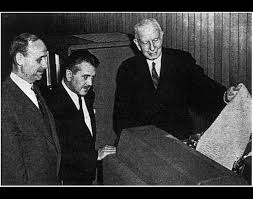

# The Georgetown Experiment

This repository contains the code and resources related to the Georgetown Experiment, a seminal event in the history of machine translation. The Georgetown Experiment, conducted on January 7, 1954, was one of the first successful demonstrations of machine translation, where 60 Russian sentences were automatically translated into English using IBM's 701 computer.

## Table of Contents
[Background](#Background)

[Overview](#Overview)

[Usage](#Usage)

[License](#License)

[References](#References)

## Background
The Georgetown Experiment is often cited as the first public demonstration of machine translation. It aimed to showcase the potential of computers to perform translation tasks, albeit in a highly controlled environment. The experiment used a small vocabulary and a limited set of grammar rules to translate Russian texts into English.

## Overview
This repository includes:

Translation Rules: The set of rules used to map Russian sentences to their English equivalents.

Glossary: The vocabulary list used in the experiment, including both Russian and English words.

Simulation Code: Python code that simulates the translation process used in the Georgetown Experiment.

## Usage
`git clone https://github.com/ashhass/The-Georgetown-Experiment.git`

`python program.py`

## License
This project is licensed under the [MIT License](LICENSE)

## References
[The first public demonstration of machine translation:
the Georgetown-IBM system, 7th January 1954](https://open.unive.it/hitrade/books/HutchinsFirst.pdf)

[The translation memorandum](https://aclanthology.org/www.mt-archive.info/90/MTNI-1999-Hutchins.pdf)
